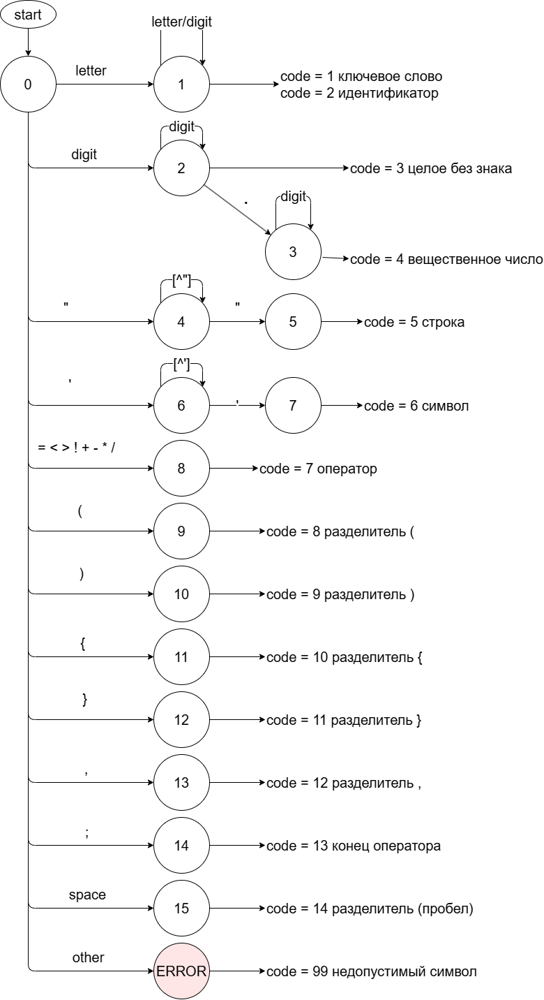
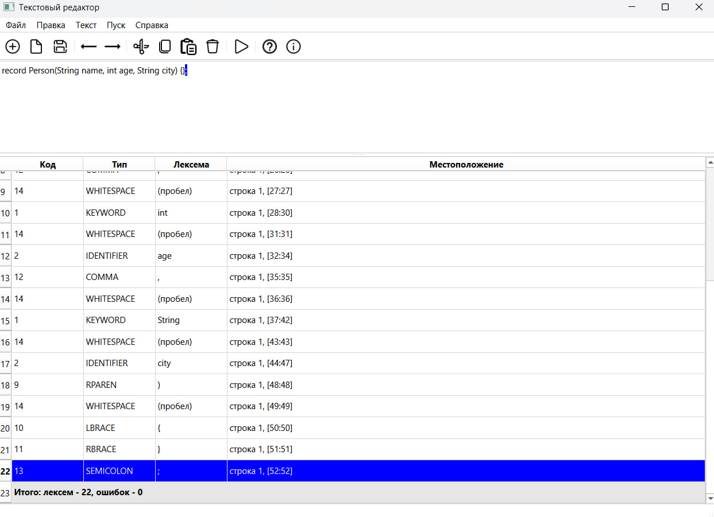
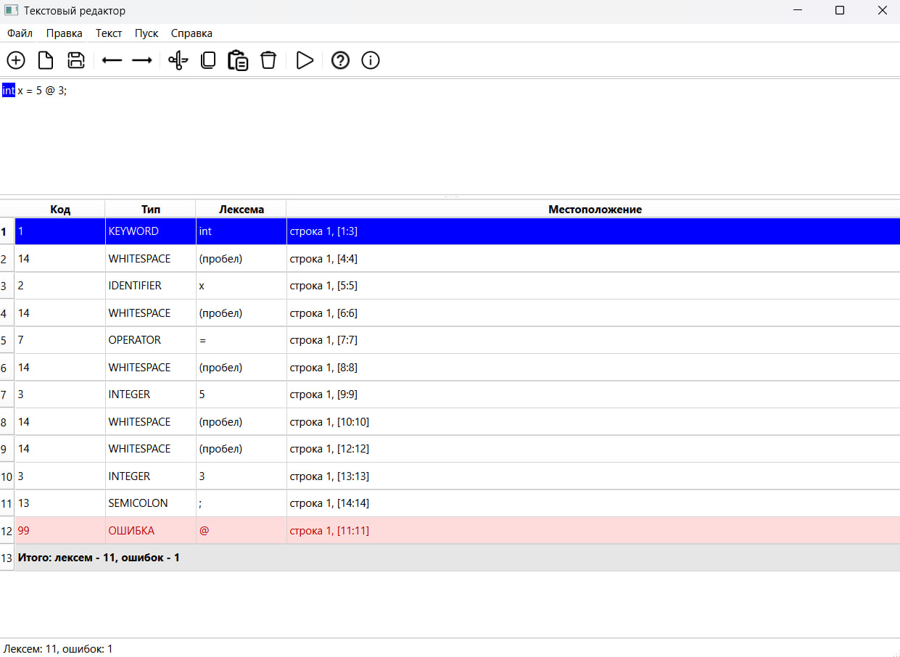
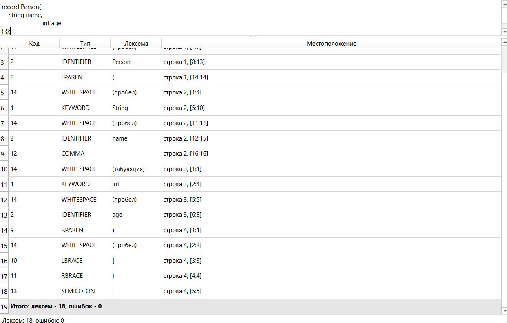
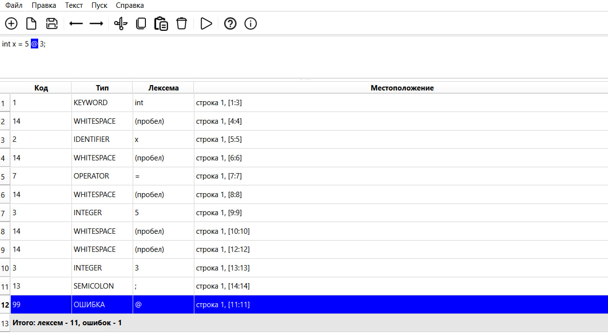

# Лабораторная работа №2 - Разработка лексического анализатора (сканера)

## Цель работы
Изучить назначение и принципы работы лексического анализатора в структуре компилятора. Спроектировать алгоритм (диаграмму состояний) и выполнить программную реализацию сканера для выделения лексем из входного текста. Интегрировать разработанный модуль в ранее созданный графический интерфейс языкового процессора.

## Автор
+ Башинов Арья Игоревич
+ Группа: АП-326

## Постановка задачи
Необходимо разработать лексический анализатор, который:
+ принимает на вход строку (исходный текст программы);
+ выделяет все допустимые лексемы согласно варианту;
+ классифицирует лексемы по типам (ключевое слово, идентификатор, число, оператор, разделитель);
+ любые символы, не соответствующие ни одному из допустимых типов лексем, считает недопустимыми и выводит сообщение об ошибке с указанием позиции;
+ учитывает многострочность входного текста.

Результат выводится в виде таблицы, которая содержит:
+ условный код лексемы;
+ тип лексемы;
+ саму лексему;
+ местоположение (номер строки, начальная и конечная позиция).

## Вариант задания
**Номер варианта: 17.** Объявление структуры на языке Java.

Пример корректной строки:
```java
record Person(String name, int age, String city) {};
```

Допустимые лексемы:

| Условный код | Тип лексемы | Пример |
| --- | --- | --- |
| 1 | Ключевое слово | `record`, `String`, `int`, `long`, `double`, `float`, `boolean`, `char`, `byte`, `short` |
| 2 | Идентификатор | `Person`, `name`, `age`, `city` |
| 3 | Целое без знака | `123`, `0`, `42` |
| 4 | Вещественное число | `3.14`, `0.5`, `1.0` |
| 5 | Строковый литерал | `"Hello"`, `"name"` |
| 6 | Символьный литерал | `'a'`, `'x'` |
| 7 | Оператор | `=`, `==`, `!=`, `<`, `>`, `<=`, `>=`, `+`, `-`, `*`, `/`, `&&`, `\|\|`, `!` |
| 8 | Разделитель `(` | `(` |
| 9 | Разделитель `)` | `)` |
| 10 | Разделитель `{` | `{` |
| 11 | Разделитель `}` | `}` |
| 12 | Разделитель `,` | `,` |
| 13 | Конец оператора `;` | `;` |
| 14 | Пробельный разделитель | пробел, табуляция |
| 99 | Недопустимый символ (ошибка) | `@`, `#`, `$` |

## Диаграмма состояний



Описание работы автомата:
+ Автомат начинает работу в состоянии 0 (START).
+ При встрече буквы или символа `_` выполняется переход в состояние 1 (накопление идентификатора). После завершения лексемы проверяется, является ли она ключевым словом: если да - код 1, иначе код 2.
+ При встрече цифры выполняется переход в состояние 2 (накопление целого числа, код 3). При появлении точки автомат переходит в состояние 3 (накопление вещественного числа, код 4).
+ При встрече открывающей кавычки `"` автомат переходит в состояние 4 (накопление строкового литерала до закрывающей кавычки, код 5).
+ При встрече одинарной кавычки `'` автомат переходит в состояние 6 (накопление символьного литерала до закрывающей кавычки, код 6).
+ При встрече символа оператора автомат переходит в состояние 8 (код 7). Автомат распознаёт как односимвольные операторы (`=`, `<`, `>`, `+`, `-`, `*`, `/`, `!`), так и двухсимвольные (`==`, `!=`, `<=`, `>=`, `&&`, `||`).
+ Одиночные разделители распознаются сразу: `(` - код 8, `)` - код 9, `{` - код 10, `}` - код 11, `,` - код 12, `;` - код 13.
+ Последовательность пробельных символов распознаётся как один пробельный разделитель (код 14).
+ Любой другой символ считается недопустимым и выводится как ошибка с кодом 99 с указанием позиции.

## Интерфейс программы

Область вывода результатов представляет собой таблицу с четырьмя колонками: код, тип лексемы, лексема, местоположение. Строки с ошибками выделяются красным цветом. В конце таблицы выводится итоговая строка с общим количеством лексем и ошибок.

### Корректная строка
Входная строка:
```java
record Person(String name, int age, String city) {};
```
Результат работы программы:



### Строка с недопустимым символом
Входная строка:
```java
int x = 5 @ 3;
```
Результат работы программы:



Символ `@` не относится ни к одному из допустимых типов лексем, поэтому он отмечен как ошибка с кодом 99, а строка подсвечена красным.

### Многострочный ввод
Входная строка:
```java
record Person(
    String name,
	int age
) {};
```
Результат работы программы:



### Навигация по ошибкам
При щелчке на строке таблицы курсор в области редактирования устанавливается на соответствующую позицию. Если щёлкнуть на строке с ошибкой, выделяется недопустимый символ.



## Используемые технологии
+ Язык программирования: Python 3.10+
+ GUI-фреймворк: PySide6 (Qt for Python)
+ Среда разработки: Visual Studio Code

## Инструкция по сборке и запуску
Клонировать репозиторий:
```powershell
git clone https://github.com/korposs/TFYAK_Lab2.git
cd TFYAK_Lab2
```

Установить зависимости:
```powershell
py -m pip install -r requirements.txt
```

Запустить приложение:
```powershell
py main.py
```

В средах, где Python запускается командой `python`, использовать её вместо `py`.

## Структура проекта
```text
TFYAK_Lab2/
├── main.py                       # точка входа приложения
├── text_editor.py                # главное окно и логика интерфейса
├── requirements.txt
├── README.md
├── .gitignore
├── compiler/
│   ├── __init__.py
│   ├── grammar.py                # константы грамматики (типы лексем, ключевые слова)
│   └── scanner.py                # лексический анализатор
├── resources/
│   └── icons/                    # иконки панели инструментов
└── images/                       # иллюстрации для README
```

## Ограничения
+ Синтаксический и семантический анализ не реализованы. Команда «Пуск» выполняет только лексический анализ.
+ Пункты меню «Текст» открывают окна с краткими описаниями-заглушками. Содержимое будет наполнено в следующих лабораторных работах.
+ Поддерживается работа с одним документом в одном окне.
+ Подсветка синтаксиса отсутствует.
+ Файлы читаются и сохраняются только в кодировке UTF-8.

## Вывод
В ходе лабораторной работы был успешно реализован лексический анализатор (сканер), который:
+ распознаёт ключевые слова, идентификаторы, целые и вещественные числа, строковые и символьные литералы, операторы и разделители;
+ определяет позицию каждой лексемы в тексте (номер строки, начальная и конечная позиция);
+ обрабатывает недопустимые символы и выводит их с указанием позиции;
+ корректно работает с многострочным вводом;
+ интегрирован в графический интерфейс, разработанный в лабораторной работе №1.